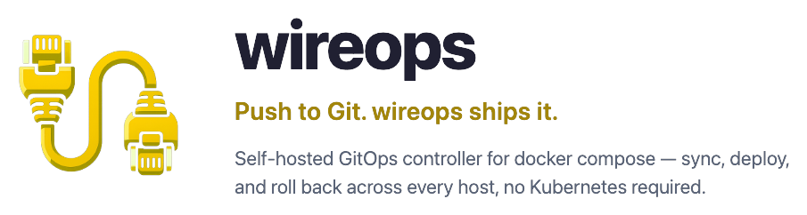
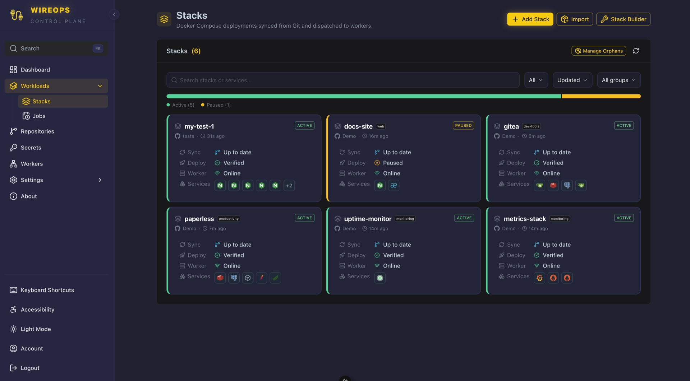
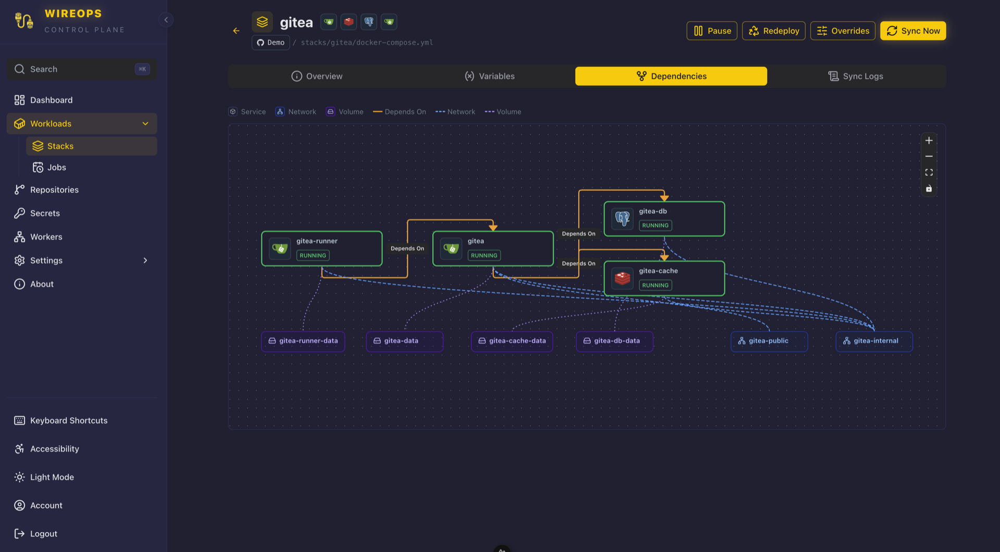
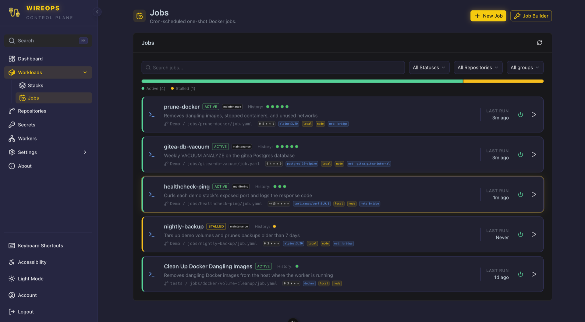
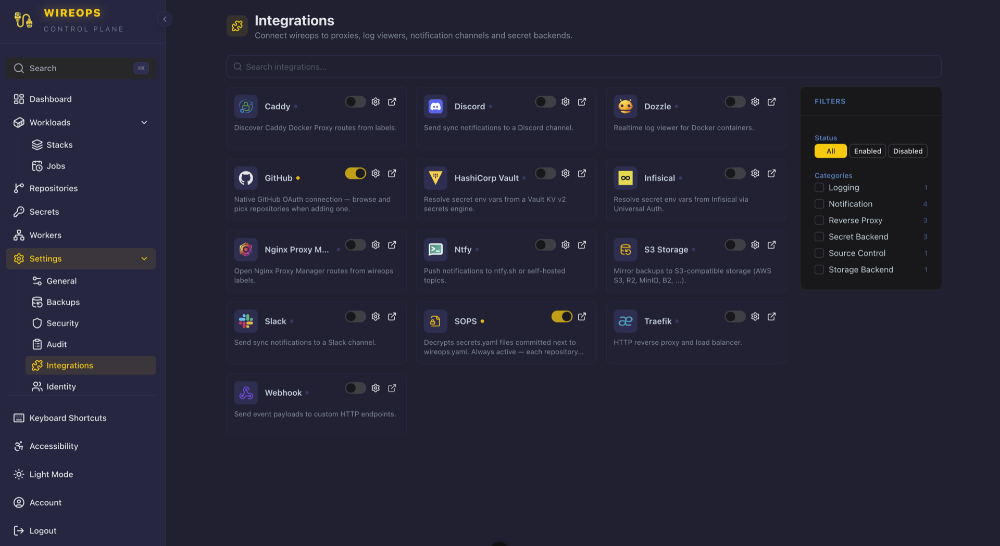
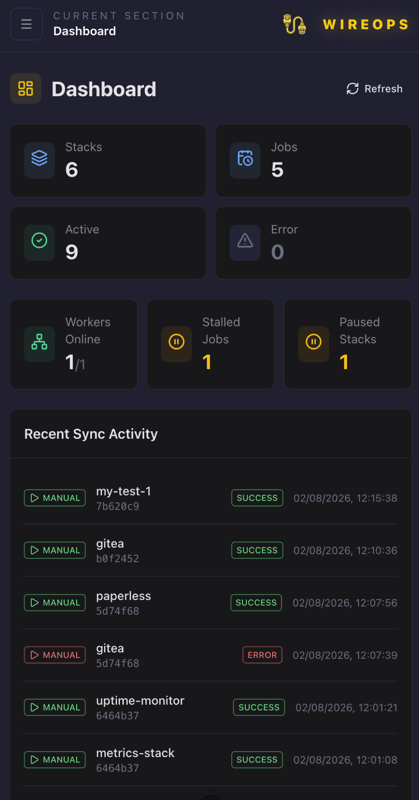
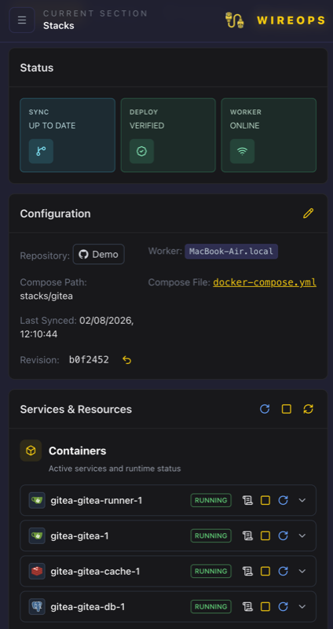
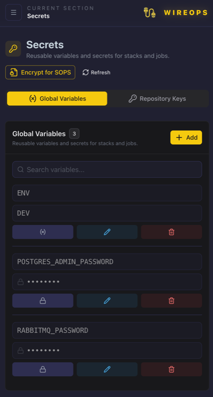

<p align="center">
  
</p>

[](https://github.com/wireops/wireops/releases/latest)
[](https://github.com/wireops/wireops/actions/workflows/server-ci.yml)
[](https://github.com/wireops/wireops/actions/workflows/worker-ci.yml)
[](https://github.com/wireops/wireops/actions/workflows/mcp-ci.yml)
[](https://snyk.io/test/github/wireops/wireops)
[](.govulncheck-allowlist.txt)
[](go.mod)
[](.github/workflows/server-ci.yml)
[](frontend/package.json)
[](LICENSE)
[](https://app.codacy.com/gh/wireops/wireops/dashboard?utm_source=gh&utm_medium=referral&utm_content=&utm_campaign=Badge_grade)
[](https://app.codacy.com/gh/wireops/wireops/dashboard?utm_source=gh&utm_medium=referral&utm_content=&utm_campaign=Badge_coverage)

**Push to Git. wireops ships it.** A self-hosted GitOps controller that watches your repos and rolls out `docker compose` changes across every host you own — no Kubernetes, no YAML sprawl, no manual SSH-and-pray deploys. Think Flux/ArgoCD, but for plain Compose stacks.

> **Project status**: pre-1.0 (releases `v0.1.x`), now in a maintenance phase — only point bugfixes, no active feature development. Core GitOps sync, worker security policies, RBAC, external secret providers (Vault, Infisical), and the audited web terminal are in daily use.

📚 **Full technical docs** (architecture, data model, API reference, env vars, MCP server, disaster recovery, integrations) live in the **[Wiki](https://github.com/wireops/wireops/wiki)**.

## Project Scope

Targets developers, homelabs, and self-hosters running plain `docker compose` stacks across one or many hosts and repos — GitOps sync/deploy, without manifest sprawl or enterprise-grade autoscaling/control-plane complexity. 

**Not** a Kubernetes/Swarm alternative, not a competitor to Flux/ArgoCD or enterprise app-management platforms. For production workloads exposed to the internet at enterprise scale (multi-node autoscaling, high availability, compliance-grade orchestration), prefer Kubernetes (with Flux/ArgoCD) instead.

## Table of Contents

- [Project Scope](#project-scope)
- [Features](#features)
- [Screenshots](#screenshots)
- [Tech Stack](#tech-stack)
- [Quick Start](#quick-start)
- [Usage](#usage)
- [Configuration](#configuration)
- [Customization](#customization)
- [Development](#development)
- [Known Limitations](#known-limitations)
- [Backlog / Future Enhancements](#backlog--future-enhancements)
- [License](#license)
- [Contributing](#contributing)

Deeper technical docs (moved to the [Wiki](https://github.com/wireops/wireops/wiki)): [Architecture](https://github.com/wireops/wireops/wiki/Architecture) · [Stack and Job Configuration](https://github.com/wireops/wireops/wiki/Stack-and-Job-Configuration) · [Data Model](https://github.com/wireops/wireops/wiki/Data-Model) · [API Reference](https://github.com/wireops/wireops/wiki/API-Reference) · [Environment Variables](https://github.com/wireops/wireops/wiki/Environment-Variables) · [Observability](https://github.com/wireops/wireops/wiki/Observability) · [MCP Server](https://github.com/wireops/wireops/wiki/MCP-Server) · [Disaster Recovery](https://github.com/wireops/wireops/wiki/Disaster-Recovery) · [Integrations](https://github.com/wireops/wireops/wiki/Integrations)

## Features

- 🐳 Docker Compose stack management
- 🔄 Automatic synchronization from Git repositories
- 📊 Real-time container monitoring
- 🔐 Share secrets to your Stack/Job with SOPS+age, HashiCorp Vault, Infisical integrations
- 🛡️ Strong Policy and RBAC system, with audit logging
- 🔑 SSO login via any OIDC provider
- 🌐 Webhook, Discord, Slack, and ntfy notifications
- 🚀 Force redeploy with recreate options
- 🗓️ Cron-scheduled one-shot Docker jobs
- 🔄 Rollback to previous commits
- 🐙 Native GitHub OAuth connect
- 💻 Audited web terminal, RBAC-gated
- 🎛️ Optional render-time stack overrides (image/ports/networks) for one-off validation testing, without a git commit

## Screenshots

*Click any screenshot to zoom.*

### Desktop

<p align="center">
  <a href=".github/assets/screenshots/stacks-overview.png"></a><br>
  <sub><b>Stacks</b> — every Compose deployment, sync/deploy status, and assigned worker</sub>
</p>

<p align="center">
  <a href=".github/assets/screenshots/dependency-graph.png"></a><br>
  <sub><b>Dependency graph</b> — visualize service, network, and volume dependencies per stack</sub>
</p>

<p align="center">
  <a href=".github/assets/screenshots/jobs.png"></a><br>
  <sub><b>Jobs</b> — cron-scheduled one-shot Docker jobs with run history</sub>
</p>

<p align="center">
  <a href=".github/assets/screenshots/integrations.png"></a><br>
  <sub><b>Integrations</b> — Traefik, Caddy, Dozzle, Vault, Infisical, SOPS, and more</sub>
</p>

### Mobile

<p align="center">
  <a href=".github/assets/screenshots/mobile-dashboard.png"></a>
  &nbsp;&nbsp;
  <a href=".github/assets/screenshots/mobile-stack-detail.png"></a>
  &nbsp;&nbsp;
  <a href=".github/assets/screenshots/mobile-secrets.png"></a><br>
  <sub><b>Mobile-friendly UI</b> — manage stacks and secrets from your phone</sub>
</p>

## Tech Stack

- **Backend**: Go + PocketBase
- **Frontend**: Nuxt 4 + Vue 3 + Nuxt UI
- **Container Runtime**: Docker + Docker Compose
- **Database**: SQLite (via PocketBase)

## Quick Start

wireops has two pieces you bring up separately: the **server** first, then one or more **workers** that register against it (see the [Architecture wiki page](https://github.com/wireops/wireops/wiki/Architecture) for why). The `example/docker-compose.yml` file has both services predefined.

**1. Start the server**

Generate a 32-byte key for `SECRET_KEY` (this encrypts every secret wireops stores — git passwords, SSH keys, integration tokens — so treat it like any other production credential):

```bash
openssl rand -hex 32
```

```bash
cp .env.example .env
# Edit .env: set SECRET_KEY to the value generated above, and set BOOTSTRAP_TOKEN
# Optionally set APP_URL for production deployments

cd example
docker compose up -d wireops
# Or run directly: go run main.go serve
```

Example `.env` values:

```bash
SECRET_KEY=<paste the openssl output here>
BOOTSTRAP_TOKEN=replace-with-a-strong-one-time-token
```

**2. Create the first administrator account**

There are no default credentials — wireops requires a bootstrap token for the first web-based setup. Open `http://localhost:8090/setup` (or `http://<server-ip>:8090/setup`), enter the `BOOTSTRAP_TOKEN` you set, and create the admin account. The setup route closes itself automatically once that first admin exists.

Notes:
- `BOOTSTRAP_TOKEN` is only used while no administrator exists yet — if it's missing on a fresh instance, the setup page stays blocked until it's configured.
- After setup is complete, keeping or removing `BOOTSTRAP_TOKEN` doesn't reopen setup, but removing it is recommended.

**3. Issue a worker token**

Once logged in, go to **Workers → Add Worker** in the UI and copy the token it gives you.

**4. Start a worker**

```bash
# in the same example/ directory
WORKER_TOKEN=paste-the-token-here WORKER_TAGS=prod,eu-west-1 docker compose up -d wireops-worker
```

The worker connects out to the server, registers with that token, and starts polling for stacks/jobs to run. Check **Workers** in the UI — it should flip to `ACTIVE` within a few seconds.

`WORKER_TAGS` labels what a worker is for (e.g. `prod`, `eu-west-1`) — required, comma-separated, set on the worker itself, not in the UI. A `job.yaml` can require tags to pick its target worker, and a `wireops.yaml` can suggest them to narrow the worker picker — see [Configuration](#configuration).

## Usage

1. **Add a Repository**: Configure your Git repository with credentials if needed
2. **Create a Stack**: Link a stack to a repository, specify compose file location
3. **Configure**: Set environment variables, poll interval, and sync options
4. **Deploy**: Stacks auto-sync on interval or trigger manually/via webhook

## Configuration

Two config files live in your Git repo and describe *what* wireops should run. Everything else — env vars, secrets bindings, render overrides — is stored in wireops itself, not in the repo.

| File | Describes | Discovered by | Re-read after changes? |
| --- | --- | --- | --- |
| `wireops.yaml` (or `.yml`) | One Compose stack | Exact filename, any subdirectory | ❌ Read once, when the stack is created |
| `job.yaml` (any filename) | One cron-scheduled job | Content sniffing: has `name`, `image`, and `cron` | ✅ Re-read on every repo sync and every run |

Both are optional: you can also create a stack by picking a compose file in the UI (`config_source: manual`), which leaves every deploy setting editable there.

### Stacks — `wireops.yaml`

Committing a `wireops.yaml` next to your compose file lets the repo, rather than the UI, own the stack's deploy settings. Point **Stacks → New Stack → From wireops.yaml** at it and wireops parses the file server-side and creates the stack from it. The compose file is found automatically: it must be the *only* compose file in that same directory.

```yaml
version: wireops.v1        # required, must be exactly "wireops.v1"
name: "my-app"             # required — becomes the stack name
group: "production"        # optional — UI grouping
timeout: "10m"             # optional — deploy timeout, Go duration, min 1s
compose:
  remove_orphans: true     # optional, default true
  force_pull: false        # optional, default false
jobs:
  wait_running: true       # optional, default false — hold deploys while a job
                           # from the same repo is running
worker:
  tags: ["prod", "eu-west-1"]  # optional — filters the worker picker in the UI
sync:
  interval: "60s"          # optional — poll interval for this stack; falls back
                           # to the global SCAN_PERIOD when unset
```

Every field above is copied into the stack record at creation time and then **locked**: fields sourced from `wireops.yaml` are rejected on update, so the file stays the single source of truth. Editing the file later does *not* update an existing stack — delete the stack and recreate it from the updated file.

### Jobs — `job.yaml`

Cron-scheduled one-shot Docker containers. The file is the single source of truth (there's no separate UI config to drift from it), and unlike `wireops.yaml` it *is* re-read continuously: schedule changes are picked up on the next repo sync, and image/command/resources on the next run.

```yaml
name: "database-backup"    # required
description: "Nightly backup of the postgres database"  # required
cron: "0 2 * * *"          # required
image: "postgres:15-alpine"  # required
command: ["pg_dump", "-h", "db", "-U", "postgres", "mydb"]  # string or list
tags: ["backup", "prod"]   # dispatch filter — a worker must carry ALL of these
group: "maintenance"       # optional — UI grouping
mode: "once"               # "once" (one worker) or "once_all" (every match)
volumes:
  - "/opt/backups:/backups"
network: "prod_network"
resources:                 # required block — all three keys mandatory
  cpu: "0.5"               # CPU limit (e.g. "0.5" or "2")
  memory: "512m"           # Memory limit (e.g. "256m" or "1g")
  timeout: "15m"           # Run timeout, Go duration (e.g. "10m", "1h")
configs:                   # optional — mount git-committed files, read-only
  - name: pgpass
    path: "config/pgpass"  # repo-relative file or directory
    target: "/root/.pgpass"  # absolute in-container path
    mode: "0600"           # optional, octal
```

`resources` is mandatory by design, so a runaway job can't quietly eat a host.

> ⚠️ `tags` on a job is a **hard** dispatch filter — a worker must carry every listed tag or the run is marked stalled. `worker.tags` in `wireops.yaml` is only an advisory filter on the worker dropdown at stack creation.

### Environment variables and secrets

Stack and job env vars are managed in the UI, not in these files, and resolve in this order (later wins):

1. **Global env vars** bound to the stack/job
2. **Stack-local / job-local env vars** — values marked secret are AES-GCM encrypted at rest, or resolved on demand from Vault/Infisical
3. **SOPS `secrets.yaml`** — stacks only: a `secrets.yaml`/`secrets.yml` sitting next to the stack's compose file, auto-decrypted with the repository's age key

For stacks the result is written to a `.env` file (mode `0600`) alongside the compose file at deploy time, so `${VAR}` in your compose file resolves normally; jobs receive theirs as `-e` flags on `docker run`.

### Mounting config files into stacks

Stacks have no `configs:` block in `wireops.yaml` — they use a per-service compose annotation instead, so the compose file stays the place where service-level intent lives:

```yaml
services:
  app:
    image: nginx:latest
    annotations:
      dev.wireops.config.nginx: "config/nginx.conf:/etc/nginx/nginx.conf"
      #                          ^ repo-relative source : in-container target
```

wireops reads the file at render time and embeds its contents into the rendered compose revision — the worker never needs repo access. A directory source is expanded recursively. Files are capped at 1MB each and 5MB total per deploy, and symlinks are rejected.

📚 Full field-by-field reference, defaults, validation rules, and troubleshooting: **[Stack and Job Configuration wiki page](https://github.com/wireops/wireops/wiki/Stack-and-Job-Configuration)**.

## Customization

### Custom Container Thumbnails

You can customize the image slug (icon/identifier) displayed in the UI for your containers by adding the `customization.image.slug` label to your Docker Compose services.

These images are fetched from the [selfh.st/icons](https://selfh.st/icons/) catalog and served globally via its CDN. The slug you provide must match the identifier used in their catalog.

The application automatically extracts this value from the service's `labels`, `annotations`, `deploy.labels`, or `deploy.annotations`.

**Example `docker-compose.yml`:**

```yaml
services:
  app:
    image: nginx:latest
    labels:
      - "customization.image.slug=nginx"
```

### Override Deployment

Stacks support render-time overrides — swapping a service's `image`, `ports`, or `networks` without committing anything to git. Overrides are stored on the stack (not the repo), applied only when the compose file is rendered for deploy, and only take effect the next time the stack is rendered/redeployed.

- Gated by the **"Allow render overrides"** worker policy flag (`allow_render_overrides`), off by default — set it globally or per-worker in worker policy settings.
- View, set, and clear overrides from the stack detail page, or via `GET`/`PUT`/`DELETE /api/custom/stacks/{id}/render-overrides`.
- Overridden values still pass through the worker's other deploy policy checks (image/network allowlists, etc.) — an override can't be used to bypass policy.
- Applying or clearing overrides force-recreates the stack's containers.

## Environment Variables

`SECRET_KEY` and `BOOTSTRAP_TOKEN` are required — see [Quick Start](#quick-start) above. 

For the full server/worker env var reference, SMTP, OIDC/SSO, secret providers (Vault/Infisical), and SOPS+age, see the [Environment Variables wiki page](https://github.com/wireops/wireops/wiki/Environment-Variables).

Metrics, Prometheus/Grafana scrape config, the MCP server, and the disaster-recovery runbook have also moved to the wiki: [Observability](https://github.com/wireops/wireops/wiki/Observability) · [MCP Server](https://github.com/wireops/wireops/wiki/MCP-Server) · [Disaster Recovery](https://github.com/wireops/wireops/wiki/Disaster-Recovery).

## Integrations

Wireops ships two kinds of integration plugin, registered the same way (`internal/integrations/`) and enabled/configured from the same Settings screen: **container-action** integrations (Traefik, Caddy, Nginx Proxy Manager, Dozzle) add clickable "Open"/"Logs" shortcuts to the container list; **notification** integrations (Webhook, Discord, Slack, Ntfy) send a message when a sync event fires and don't touch the container list.

Full plugin interface, config fields, and label/compose examples: [Integrations wiki page](https://github.com/wireops/wireops/wiki/Integrations).

## Development

```bash
# Backend
go run main.go serve

# Frontend
cd frontend
npm install
npm run dev
```

---

## Known Limitations

- No OCI-artifact source, Docker Swarm/multi-node, or canary/preview deploys yet (tracked as strategic backlog with no ETA).

## Backlog / Future Enhancements

### 📋 Logs & Debugging
- Advanced log viewer with syntax highlighting
- Search/filter within logs
- Download logs functionality
- Diff viewer for commit comparisons

### 🔄 Bulk Operations
- Multi-select stacks with checkboxes
- Bulk actions: "Sync All", "Pause All", "Resume All"
- Progress tracking for batch operations

### 🌍 Environment Variables Management
- Bulk edit mode (text editor format KEY=VALUE)
- Import/export .env files
- Copy env vars between stacks
- Templates for common variables
- Detect required variables from compose file

### 🐳 Container Management
- "Restart All" / "Stop All" buttons per service
- Bulk container operations

### ⚙️ User Preferences
- Configurable auto-refresh interval
- Theme preferences
- UI density options (compact/comfortable)

### 🔒 Security & Ops (strategic)
- Git auth hardening, deploy metrics/alerts
- docker-run → compose converter, OCI artifact sources, Swarm/multi-node, canary deploys

---

## License

AGPLv3 — see [LICENSE](LICENSE)

wireops is free/open-source software. Forks and derivative works must also
be released under AGPLv3 (or a compatible license) and must credit
**wireops** ([github.com/wireops/wireops](https://github.com/wireops/wireops))
as the original project — see [NOTICE](NOTICE).

## Contributing

Contributions are welcome! Please open an issue or PR.
